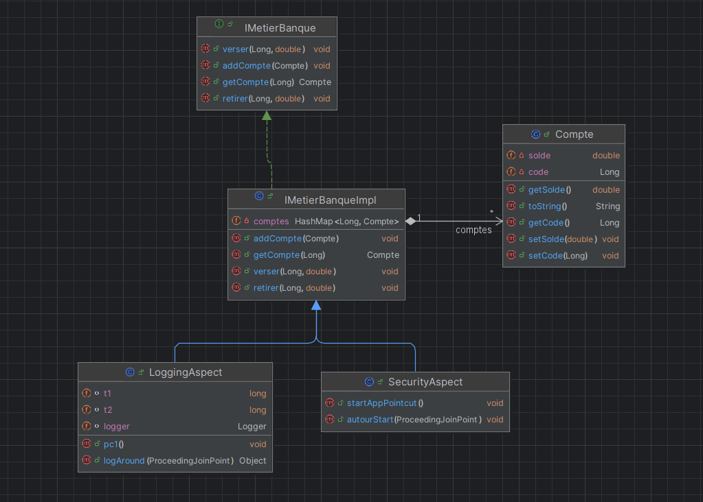

# Application Bancaire avec Spring AOP

Cette application est conçue pour gérer des comptes bancaires stockés en mémoire à 
l'aide d'une collection de type `Map`. Chaque compte est défini par un **code** unique et un **solde**.

---
## Fonctionnalités

L'application offre les fonctionnalités suivantes :
- **Ajouter un compte** : Permet de créer un nouveau compte bancaire.
- **Consulter un compte** : Permet de récupérer les informations d'un compte existant.
- **Verser un montant** : Ajoute un montant au solde d'un compte.
- **Retirer un montant** : Retire un montant du solde d'un compte, avec des validations.

---

## Exigences Techniques

Les exigences techniques sont implémentées sous forme d'aspects :

1. **LoggingAspect** :
    - Journalise les appels de toutes les méthodes.
    - Affiche la durée d'exécution de chaque méthode.

2. **PatchAspect** :
    - Valide les montants des opérations de versement et de retrait.

3. **SecurityAspect** :
    - Sécurise les méthodes de l'application pour empêcher les accès non autorisés.

---
## Architecture

L'architecture de l'application se compose des éléments suivants :

### Classes principales

- **Compte** : Représente un compte bancaire avec les attributs suivants :
    - `code` : Identifiant unique du compte (de type `Long`).
    - `solde` : Solde du compte (de type `double`).

- **IMetier** : Interface définissant les opérations principales :
    - `addCompte(Long code, Compte cp)`
    - `verser(Long code, double solde)`
    - `retirer(Long code, double solde)`
    - `getCompte(Long code)`

- **MetierImpl** : Implémentation de l'interface `IMetier`. Les comptes sont stockés dans une collection de type `Map<Long, Compte>`.

---
## Diagramme UML

Voici un diagramme UML de l'architecture de l'application :

